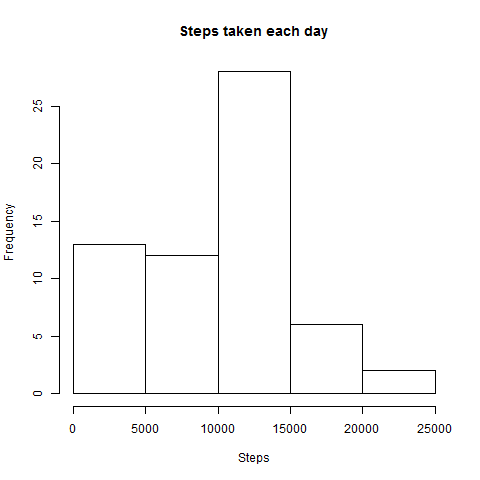
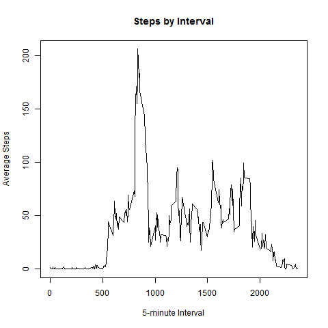
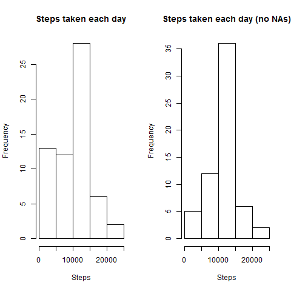
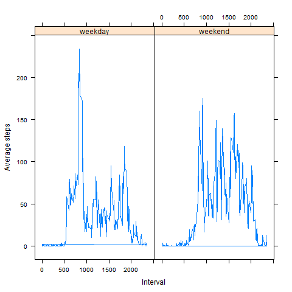

# Reproducible Research: Peer Assessment 1
Leonardo Razuk Jorge Froede  


## Loading and preprocessing the data


```r
if (!file.exists("activity.csv")){
    unzip("activity.zip")
}
activity = read.csv("activity.csv")
```

## What is mean total number of steps taken per day?

1. Make a histogram of the total number of steps taken each day


```r
#Calculate the Total number of steps taken per day
stepsPerDay = tapply(activity$steps, activity$date, FUN = sum, na.rm = T)
#Make a histogram of the total number of steps taken each day
png(filename = "question_1_hist_steps_per_day.png", width = 480, height = 480)
hist(stepsPerDay, main = "Steps taken each day", xlab="Steps")
dev.off()
```



2. Calculate and report the **mean** and **median** total number of steps taken per day

```r
#Calculate mean of steps taken per day
mean(stepsPerDay)
#Calculate mean of steps taken per day
median(stepsPerDay)
```

Mean of steps taken per day: **9354.23**.

Median of steps taken per day: **10395**.

## What is the average daily activity pattern?

1. Make a time series plot (i.e. `type = "l"`) of the 5-minute interval (x-axis) and the average number of steps taken, averaged across all days (y-axis)

```r
#Generates data frame with steps averaged by intervals, across all days
stepsPerInterval = ddply(activity, .(interval), summarise, avg=mean(steps, na.rm = T))
#Plots average steps by 5-minute interval
png(filename = "question_2_time_series_plot_steps_per_interval.png", width = 480, height = 480)
plot(stepsPerInterval, type = "l", xlab="5-minute Interval", ylab="Average Steps", 
     main="Steps by Interval")
#Gets the interval with maximum average steps.
stepsPerInterval[stepsPerInterval$avg == max(stepsPerInterval$avg), "interval"]
dev.off()
```



2. Which 5-minute interval, on average across all the days in the dataset, contains the maximum number of steps?


```r
#Gets the interval with maximum average steps.
stepsPerInterval[stepsPerInterval$avg == max(stepsPerInterval$avg), "interval"]
```

The interval number **835** has the maximum average number of steps.

## Imputing missing values

1. Calculate and report the total number of missing values in the dataset (i.e. the total number of rows with `NA`s)

```r
#Gets the total number of rows with at least 1 NA value.
sum(!complete.cases(activity))
```

The total number of missing values is **2304**.

2. Devise a strategy for filling in all of the missing values in the dataset. The strategy does not need to be sophisticated. For example, you could use the mean/median for that day, or the mean for that 5-minute interval, etc.

The chosen strategy was to fill the missing values with the corresponding 5-minute interval mean.

3. Create a new dataset that is equal to the original dataset but with the missing data filled in.


```r
#Creates a new data frame based on the activity data frame to replace the NA values.
activity2 = activity
#Creates a new column to store the mean steps per interval.
activity2$avgByInterval = ave(activity2$steps, activity2$interval, 
                              FUN = function(x) mean(x, na.rm=T))
#Iterates through the rows and replaces steps NA values with the mean value for the corresponding
#interval
for(i in 1:nrow(activity2)){
    if (is.na(activity2$steps[i])){
        activity2$steps[i] = activity2$avgByInterval[i]
    }
}
```

4. Make a histogram of the total number of steps taken each day and Calculate and report the **mean** and **median** total number of steps taken per day. Do these values differ from the estimates from the first part of the assignment? What is the impact of imputing missing data on the estimates of the total daily number of steps?


```r
#Calculate the Total number of steps taken per day
stepsPerDay = tapply(activity$steps, activity$date, FUN = sum, na.rm = T)
#Calculate the Total number of steps taken per day (without NAs)
stepsPerDayWithoutNAs = tapply(activity2$steps, activity2$date, FUN = sum, na.rm = T)
png(filename = "question_3_hist_steps_per_day_comparison.png", width = 480, height = 480)
#Configures global graphic parameter to show two plots side by side.
par(mfrow = c(1, 2))
#Make a histogram of the total number of steps taken each day
hist(stepsPerDay, main = "Steps taken each day", xlab="Steps")
#Make a histogram of the total number of steps taken each day (Without NAs)
hist(stepsPerDayWithoutNAs, main = "Steps taken each day (no NAs)", xlab="Steps")
#Creates a data frame with mean and median for step values per day with and without NAs.
typeOfValue = factor(c("With NA", "Without NA"))
values = data.frame(Type = typeOfValue, Mean = c(mean(stepsPerDay), mean(stepsPerDayWithoutNAs)),
                    Median = c(median(stepsPerDay), median(stepsPerDayWithoutNAs)))
values
dev.off()
```



* Means and Medians:
    * With NAs:
        + Mean: **9354.23**
        + Median: **10395.00**
    * Without NAs:
        + Mean: **10766.19**
        + Median: **10766.19**

The median didn't change, but the mean became bigger after filling the NAs.

## Are there differences in activity patterns between weekdays and weekends?

1. Create a new factor variable in the dataset with two levels -- "weekday" and "weekend" indicating whether a given date is a weekday or weekend day.


```r
#Creates a vector indicating if the date is a week day or weekend
typeOfday = vector()
for(i in 1:nrow(activity)){
    if (weekdays(as.Date(activity$date[i]), abbreviate = T) %in% c("sáb", "dom")){
        typeOfday = c(typeOfday, "weekend")
    } else {
        typeOfday = c(typeOfday, "weekday")
    }
}
#Creates a copy of the data set with a factor variable indicating if the date is a week day 
#or weekend
activity2 = activity
activity2$typeOfDay = as.factor(typeOfday)
activity2$avgByIntervalAndTypeOfDay = ave(activity2$steps, activity2$interval, activity2$typeOfDay, FUN = function(x) mean(x, na.rm=T))
```

2. Make a panel plot containing a time series plot (i.e. `type = "l"`) of the 5-minute interval (x-axis) and the average number of steps taken, averaged across all weekday days or weekend days (y-axis).


```r
#Plots the average steps per interval for week days and weekends
png(filename = "question_4_time_series_plot_per_day_comparison.png", width = 480, height = 480)
xyplot(avgByIntervalAndTypeOfDay ~ interval | typeOfDay, activity2, xlab = "Interval", 
       ylab="Average steps", type = "l")
dev.off()
```


